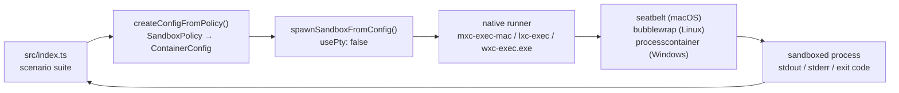
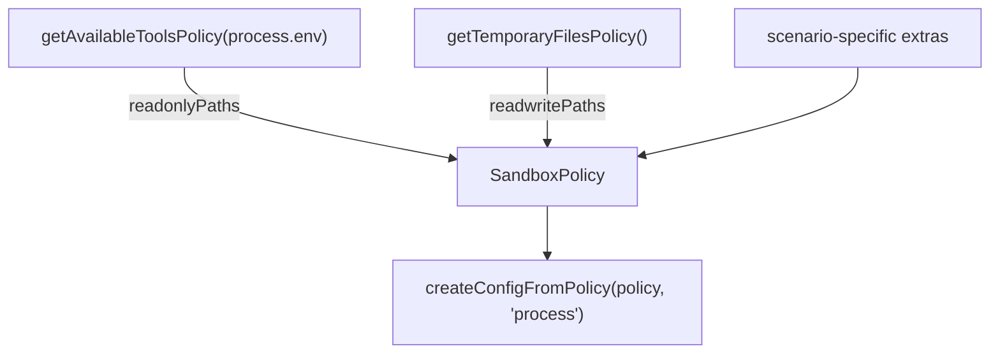

# sandbox-mxc-sdk-typescript

Experiment exercising **MXC** (Microsoft eXecution Containers) through the
[`@microsoft/mxc-sdk`](https://www.npmjs.com/package/@microsoft/mxc-sdk)
TypeScript SDK — see [microsoft/mxc](https://github.com/microsoft/mxc).

MXC runs untrusted code (model output, plugins, tools) inside an OS-native
sandbox driven by a versioned JSON policy. The same cross-platform
`SandboxPolicy` maps to `processcontainer` on Windows, `bubblewrap` on Linux,
and `seatbelt` on macOS.

> ⚠️ MXC is an **early preview**. Upstream explicitly states that generated
> policies are currently overly permissive and that **no MXC profile should be
> treated as a security boundary** yet. This experiment measures behaviour, it
> does not certify containment.

## What this experiment does

`pnpm dev` builds one policy per scenario and asserts the sandbox actually
enforces it — it is a self-checking probe, not just a demo.

| Scenario | Expectation |
|----------|-------------|
| `hello-world` | a trivial command runs inside the sandbox |
| `fs-write-allowed` | writing into `readwritePaths` succeeds |
| `fs-write-contained` | a write outside `readwritePaths` never reaches the host |
| `fs-read-denied` | reading `~/.ssh` fails (skipped if absent) |
| `net-denied` | `fetch()` fails with `allowOutbound: false` |
| `net-allowed` | `fetch()` returns `HTTP 200` when the policy opts in |
| `extra-path-denied` | a host dir absent from the policy discloses nothing |
| `extra-path-granted` | the same dir is readable once added to `readonlyPaths` |
| `readonly-stays-readonly` | a `readonlyPaths` grant still refuses writes |

A scenario whose sandbox never launched is reported as `ERROR`, never `PASS` —
otherwise every "denied" expectation would pass for the wrong reason on a host
where MXC is broken. If the baseline `hello-world` cannot start, the suite
aborts with exit code 3 instead of printing a wall of meaningless passes.

## Architecture



Policy inputs come from two SDK discovery helpers:



## Requirements

- Node.js ≥ 18 (tested on 24)
- pnpm
- A host MXC supports: Windows 11 24H2+, Linux with `bwrap`, or macOS ARM64

## Run it

```bash
pnpm install

pnpm probe   # what backends/paths does this host expose?
pnpm hello   # the upstream README sample, adapted to run
pnpm dev     # the full scenario suite (exit code 0 = all as expected)
pnpm probes  # adversarial probes: try to escape the sandbox
```

## Sample output (macOS ARM64, Seatbelt)

```
=== MXC platform support ===
host      : darwin/arm64
supported : true
backends  : seatbelt

--- fs-read-denied: reading sensitive host paths (~/.ssh) is refused
  PASS  exit=1
      Error: EPERM: operation not permitted, scandir '/Users/cv/.ssh'

--- net-denied: outbound network is blocked with allowOutbound: false
  PASS  exit=7
      blocked: fetch failed

--- net-allowed: outbound network works when the policy opts in
  PASS  exit=0
      HTTP 200

=== 9 passed, 0 failed, 0 errored, 0 skipped ===
```

## Running in Docker

On Linux, MXC uses the **`bubblewrap`** backend, which builds its sandbox from
user namespaces and mount operations. Container runtimes restrict exactly those
operations, so a stock container cannot run it.

```bash
# Works — minimum viable configuration
docker compose run --rm mxc

# Fails — stock container hardening, kept to show the failure mode
docker compose run --rm mxc-stock

# Works — but grants far more than MXC needs
docker compose run --rm mxc-privileged
```

`mxc` is **not privileged and adds no capabilities**. It needs exactly two
`security_opt` entries, each fixing a distinct failure found by bisecting:

| Option | Failure it fixes |
|--------|------------------|
| `label=disable` | `bwrap: Can't mount devpts on /newroot/dev/pts: Permission denied` — SELinux denies the devpts mount |
| `unmask=ALL` | `bwrap: Can't mount proc on /newroot/proc: Operation not permitted` — the runtime masks parts of `/proc`, and the kernel refuses a nested `proc` mount unless a fully visible instance exists |

Things that did **not** help: `--cap-add SYS_ADMIN`, `--cap-add ALL`,
`seccomp=unconfined`, `apparmor=unconfined`, or running as a non-root user.
This is a mount-visibility problem, not a capability or syscall-filter one.
`unmask=ALL` is Podman syntax; on Docker Engine the nearest equivalent is
`--security-opt systempaths=unconfined` (which this Podman host accepted but
did not honour, so it still failed here).

Container result — Debian bookworm, bwrap 0.8.0, arm64:

```
host      : linux/arm64
supported : true
backends  : bubblewrap

--- fs-write-contained: a write outside readwritePaths never reaches the host
  PASS  write redirected into the sandbox (exit=0); host file absent

--- fs-read-denied: reading sensitive host paths (~/.ssh) is refused
  SKIP  /root/.ssh does not exist on this host

--- readonly-stays-readonly: a readonlyPaths grant does not allow writes ...
  PASS  exit=1
      Error: EROFS: read-only file system, open '/app/.fixture-tQivdO/tampered.txt'

=== 8 passed, 0 failed, 0 errored, 1 skipped ===
```

If npmjs.org is unreachable from your build network, pass a registry:

```bash
docker compose build --build-arg NPM_REGISTRY=https://your-proxy/npm/ mxc
```

## Threat model — what is actually demonstrated

`pnpm dev` only proves **policy conformance**: cooperative code stays inside
the policy it was given. That is not the same as containment, because none of
those programs *try* to escape. `pnpm probes` (`src/escape-probes.ts`) does
try.

Two positive controls matter for interpreting any of this: `extra-path-granted`
and `net-allowed` must **succeed**. Without them, a totally broken sandbox
where everything fails would look like a perfect score.

### Probed and held

| Probe | Threat | Seatbelt | Bubblewrap |
|-------|--------|----------|------------|
| `symlink-read-escape` | symlink in a writable dir pointing at a secret | contained | contained |
| `symlink-write-escape` | write out through a symlink | contained | contained |
| `env-leak` | inherit host env (tokens, keys) | contained | contained |
| `loopback-egress` | reach a host service on 127.0.0.1 under `allowOutbound: false` | contained | contained |
| `signal-host-process` | signal/inspect a process outside the sandbox | contained | contained |
| `home-dir-read` | read an ungranted file in `$HOME` | contained | contained |
| `timeout-enforced` | ignore `timeoutMs` and run forever | contained | **ESCAPED** |

### Explicitly *not* covered

- **The kernel.** Both backends share the host kernel and — measured, not
  assumed — add **no syscall filter**: inside the sandbox with the container's
  own seccomp disabled, `/proc/self/status` reports `Seccomp: 0`,
  `Seccomp_filters: 0`. The entire syscall ABI is reachable, so any kernel LPE
  walks straight out. This is a filesystem/namespace boundary, not a syscall
  boundary.
- **Resource exhaustion.** Wall-clock `timeoutMs` is the only limit expressed,
  and it is not enforced on bubblewrap (finding 12). Nothing caps CPU, memory,
  disk, or process count.
- **Whatever you grant.** `readwritePaths` is a genuine hole by construction,
  and `getAvailableToolsPolicy()` grants *every* `PATH` entry read-only — about
  30 directories on my Mac, including `~/.cargo/bin`, `~/.local/bin`, `~/bin`.
  Untrusted code can read all of it, and any of those that is user-writable is
  a plausible persistence point. Narrow this for real workloads.
- **TOCTOU** on granted paths, and side channels of every kind.
- **Windows `processcontainer`** — not tested here at all.
- **Schema 0.8 directional networking** — `allowOutbound` is binary in this
  experiment; per-host/CIDR rules are untested.

### And the disclaimer that dominates all of the above

Upstream states that MXC profiles are **not security boundaries** today and
that generated policies are knowingly overly permissive. Treat these results as
a behavioural baseline to re-run as MXC matures — evidence about defaults, not
a security guarantee.

## Findings

Things the upstream sample does not spell out, learned the hard way here:

1. **`0.6.0-alpha` does not work on macOS.** Seatbelt requires schema
   `0.7.0-alpha` or later, so the README snippet fails on a Mac as written.
   This experiment pins `0.7.0-alpha`, which every stable backend accepts.
   (`0.8.0-alpha` is the current stable version but swaps `network.allowOutbound`
   for the directional `network.egress` / `network.ingress` shape.)

2. **The sandbox does not inherit `process.env`.** A bare `python` in
   `commandLine` is resolved against the backend's default `PATH`, not your
   shell's. On macOS that resolves to the `/usr/bin/python3` Xcode stub, which
   then dies trying to `dlopen` `libxcrun.dylib` — a confusing failure that
   looks like a sandbox bug but is really a PATH issue. **Use absolute
   interpreter paths.**

3. **Same reason, `os.tmpdir()` lies inside the sandbox.** Without `TMPDIR`
   in the environment, Node falls back to `/tmp`, which is *not* in
   `getTemporaryFilesPolicy().readwritePaths` (that returns the per-user
   `/var/folders/.../T/`). Pass the policy's writable path in explicitly.

4. **A binary on `PATH` is not enough — its libraries must be reachable too.**
   A pyenv-installed `python3` failed with
   `Library not loaded: /opt/homebrew/opt/gettext/lib/libintl.8.dylib` because
   `getAvailableToolsPolicy` grants `PATH` entries, not the Homebrew `lib`
   trees they link against. Adding `/opt/homebrew` to `readonlyPaths` fixed it.

5. **Enforcement itself is solid on Seatbelt** for the cases tested: filesystem
   reads/writes outside the policy, and outbound network under
   `allowOutbound: false`, all fail closed. `readonlyPaths` grants are genuinely
   read-only.

6. **Pipe mode is the better default.** `spawnSandboxFromConfig(config, { usePty: false })`
   returns a `ChildProcess` with separated `stdout`/`stderr` and a reliable exit
   code; PTY mode merges the streams.

7. **`getPlatformSupport()` is optimistic in a container.** Inside stock Docker
   it reported `supported: true, backends: bubblewrap` — the probe only runs
   `bwrap --version`, which succeeds — yet every actual spawn died at
   `Can't mount devpts`. Treat the probe as necessary, not sufficient, and run
   a real smoke-test sandbox at startup.

8. **The two backends deny differently, and a naive test can't tell.**
   Seatbelt denies the syscall on the real path (`EPERM`). Bubblewrap is
   deny-by-default *by omission*: unlisted paths simply do not exist in the
   namespace, so reads get `ENOENT` and a write to an ungranted path can return
   **exit 0** while landing in a throwaway namespace. The original
   `fs-write-denied` scenario scored that as a failure; the replacement
   `fs-write-contained` asserts the host file is absent afterwards, which is the
   property that actually matters and holds on both backends.

9. **Containers block bubblewrap on mount visibility, not capabilities.**
   See [Running in Docker](#running-in-docker) — `label=disable` + `unmask=ALL`
   is enough; `--cap-add ALL` and `seccomp=unconfined` are not.

10. **Docker is a real second containment layer here.** Because the container
    filesystem *is* the sandbox's host, the blast radius of a policy mistake is
    the container, not your laptop. Given that upstream does not yet treat MXC
    profiles as security boundaries, running MXC inside a container is the more
    defensible posture today.

11. **Alpine does not work — use a glibc base image.** The SDK ships a
    *prebuilt glibc* `lxc-exec`, and neither `libc6-compat` nor `gcompat`
    satisfies it:

    ```
    Error relocating .../bin/arm64/lxc-exec: __res_init: symbol not found
    exit: 127
    ```

    Tested on `node:22-alpine` (arm64) with both shims. `getPlatformSupport()`
    still cheerfully reported `isSupported: true, backends: ['bubblewrap']` —
    a third demonstration of finding 7. Hence `node:22-bookworm-slim`:
    glibc, and bwrap 0.8.0 in the default repos.

12. **`timeoutMs` is silently ignored on the bubblewrap backend.** Seatbelt
    kills the workload on schedule (5.0s for a 5s budget against a 60s sleep).
    On bubblewrap the process ran to completion every time — a 20s sleep under
    a 2s budget still printed `alive` after 20.1s. The call reports `exit=255`,
    which looks like a timeout but arrives only after the workload finishes, so
    a caller trusting `timeoutMs` as a resource control on Linux has no limit
    at all. Enforce your own deadline around the child process.

13. **No syscall filtering is applied by either backend.** With the container's
    own seccomp disabled, a sandboxed process reports `Seccomp: 0` and
    `Seccomp_filters: 0`. MXC here is a filesystem and namespace boundary, not
    a syscall boundary — the full kernel attack surface stays exposed.

## Files

| File | Purpose |
|------|---------|
| `src/mxc-utils.ts` | policy builder + `runInSandbox()` promise wrapper |
| `src/index.ts` | the scenario suite |
| `src/hello-sandbox.ts` | upstream README sample, adapted |
| `src/platform-probe.ts` | dumps backends and discovered policy paths |
| `src/escape-probes.ts` | adversarial probes that try to break out |
| `Dockerfile` | Debian + bubblewrap + pnpm image |
| `docker-compose.yml` | three profiles: minimal, stock (fails), privileged |

## References

- [microsoft/mxc](https://github.com/microsoft/mxc)
- [SDK README](https://github.com/microsoft/mxc/blob/main/sdk/node/README.md)
- [Seatbelt backend guide](https://github.com/microsoft/mxc/blob/main/docs/seatbelt/seatbelt-backend.md)
- [Schema reference](https://github.com/microsoft/mxc/blob/main/docs/schema.md)
