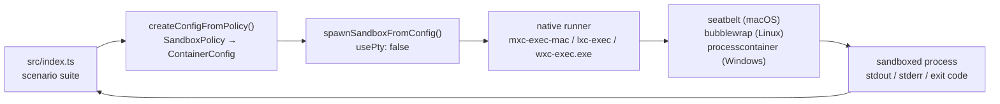
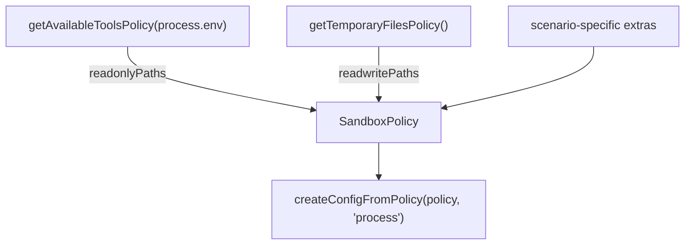

# sandbox-mxc-sdk-typescript

Experiment exercising **MXC** (Microsoft eXecution Containers) through the
[`@microsoft/mxc-sdk`](https://www.npmjs.com/package/@microsoft/mxc-sdk)
TypeScript SDK — see [microsoft/mxc](https://github.com/microsoft/mxc).

MXC runs untrusted code (model output, plugins, tools) inside an OS-native
sandbox driven by a versioned JSON policy. The same cross-platform
`SandboxPolicy` maps to `processcontainer` on Windows, `bubblewrap` on Linux,
and `seatbelt` on macOS.

> ⚠️ MXC is an **early preview**. Upstream explicitly states that generated
> policies are currently overly permissive and that **no MXC profile should be
> treated as a security boundary** yet. This experiment measures behaviour, it
> does not certify containment.

## Docs

Findings are recorded in [`docs/`](./docs) as they are discovered:

| Document | Contents |
|----------|----------|
| [docs/findings.md](./docs/findings.md) | Running log of everything learned, with verbatim evidence |
| [docs/threat-model.md](./docs/threat-model.md) | What the tests demonstrate, and what they do not |
| [docs/backends.md](./docs/backends.md) | Seatbelt vs Bubblewrap capability comparison |
| [docs/docker.md](./docs/docker.md) | Running in a container, with architecture diagrams |

## What this experiment does

Two suites, answering two different questions.

**`pnpm dev` — policy conformance.** Builds one policy per scenario and asserts
the sandbox enforces it:

| Scenario | Expectation |
|----------|-------------|
| `hello-world` | a trivial command runs inside the sandbox |
| `fs-write-allowed` | writing into `readwritePaths` succeeds |
| `fs-write-contained` | a write outside `readwritePaths` never reaches the host |
| `fs-read-denied` | reading `~/.ssh` fails (skipped if absent) |
| `net-denied` | `fetch()` fails with `allowOutbound: false` |
| `net-allowed` | `fetch()` returns `HTTP 200` when the policy opts in |
| `extra-path-denied` | a host dir absent from the policy discloses nothing |
| `extra-path-granted` | the same dir is readable once added to `readonlyPaths` |
| `readonly-stays-readonly` | a `readonlyPaths` grant still refuses writes |

A scenario whose sandbox never launched is reported as `ERROR`, never `PASS` —
otherwise every "denied" expectation would pass for the wrong reason. If the
baseline `hello-world` cannot start, the suite aborts with exit code 3.

**`pnpm probes` — containment.** The scenarios above are all *cooperative*:
they ask for a denied resource and accept the error. The probes in
`src/escape-probes.ts` actively try to get out — symlink traversal, env
inheritance, loopback egress, signalling host processes, timeout evasion and
network allowlist bypass. Results and scope in
[docs/threat-model.md](./docs/threat-model.md).

## Architecture



Policy inputs come from two SDK discovery helpers:



## Requirements

- Node.js ≥ 18 (tested on 22 and 24)
- pnpm
- A host MXC supports: Windows 11 24H2+, Linux with `bwrap`, or macOS ARM64

## Run it

```bash
pnpm install

pnpm probe   # what backends/paths does this host expose?
pnpm hello   # the upstream README sample, adapted to run
pnpm dev     # policy conformance suite (exit 0 = all as expected)
pnpm probes  # adversarial probes: try to escape the sandbox
```

In a container (Linux/bubblewrap) — see [docs/docker.md](./docs/docker.md):

```bash
docker compose run --rm mxc
```

## Sample output (macOS ARM64, Seatbelt)

```
=== MXC platform support ===
host      : darwin/arm64
supported : true
backends  : seatbelt

--- fs-read-denied: reading sensitive host paths (~/.ssh) is refused
  PASS  exit=1
      Error: EPERM: operation not permitted, scandir '/Users/cv/.ssh'

--- net-denied: outbound network is blocked with allowOutbound: false
  PASS  exit=7
      blocked: fetch failed

--- net-allowed: outbound network works when the policy opts in
  PASS  exit=0
      HTTP 200

=== 9 passed, 0 failed, 0 errored, 0 skipped ===
```

## Headline findings

The full log is in [docs/findings.md](./docs/findings.md). The ones that cost
the most time:

1. **`0.6.0-alpha` does not work on macOS** — Seatbelt needs `0.7.0-alpha`+, so
   the upstream README sample fails on a Mac as written.
2. **The sandbox does not inherit `process.env`** — a bare `python` resolves
   against the backend's default `PATH`, not your shell's. Use absolute paths.
3. **`getPlatformSupport()` is optimistic** — it reported a working backend in
   two environments where nothing could actually spawn. Smoke-test at startup.
4. **The backends deny differently** — Seatbelt returns `EPERM`; bubblewrap
   omits the path entirely, so an ungranted write can exit 0 into a throwaway
   namespace. Assert on host-side effects, not exit codes.
5. **`timeoutMs` is silently ignored on bubblewrap** — enforce your own deadline.
6. **Neither backend applies a syscall filter** — `Seccomp: 0` inside the
   sandbox. This is a filesystem/namespace boundary, not a syscall boundary.

## Files

| File | Purpose |
|------|---------|
| `src/mxc-utils.ts` | policy builder + `runInSandbox()` promise wrapper |
| `src/index.ts` | policy conformance suite |
| `src/escape-probes.ts` | adversarial probes that try to break out |
| `src/hello-sandbox.ts` | upstream README sample, adapted |
| `src/platform-probe.ts` | dumps backends and discovered policy paths |
| `Dockerfile` | Debian + bubblewrap + pnpm image |
| `docker-compose.yml` | three profiles: minimal, stock (fails), privileged |
| `docs/` | findings log, threat model, backend comparison, Docker guide |

## References

- [microsoft/mxc](https://github.com/microsoft/mxc)
- [SDK README](https://github.com/microsoft/mxc/blob/main/sdk/node/README.md)
- [Seatbelt backend guide](https://github.com/microsoft/mxc/blob/main/docs/seatbelt/seatbelt-backend.md)
- [Bubblewrap backend guide](https://github.com/microsoft/mxc/blob/main/docs/bwrap-support/bubblewrap-backend.md)
- [Schema reference](https://github.com/microsoft/mxc/blob/main/docs/schema.md)
