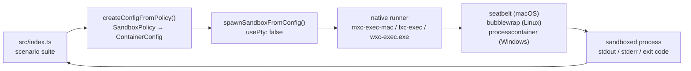
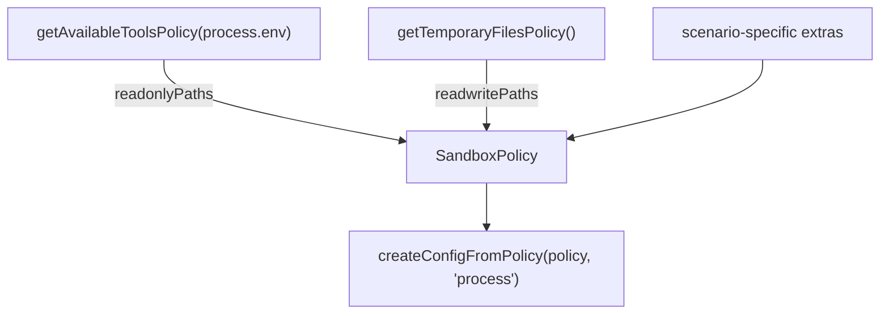

# Sandbox Containment Matrix

Empirically measuring what real sandbox systems for untrusted code (model
output, plugins, tools) actually contain — on real hosts, with verbatim
evidence, not from documentation. Each system is a row in the matrix;
[the comparison](#sandbox-systems-compared) is the headline.

The starting point is **MXC** (Microsoft eXecution Containers) via the
[`@microsoft/mxc-sdk`](https://www.npmjs.com/package/@microsoft/mxc-sdk)
TypeScript SDK ([microsoft/mxc](https://github.com/microsoft/mxc)), which runs
untrusted code inside an OS-native sandbox driven by a versioned JSON policy —
the same cross-platform `SandboxPolicy` maps to `processcontainer` on Windows,
`bubblewrap` on Linux, and `seatbelt` on macOS. From there the matrix widens to
the *same* Bubblewrap backend on **AKS**, and to a different class of sandbox
entirely: **[Fly.io Sprites](./docs/sprites.md)**, a per-tenant KVM micro-VM.

The two MXC suites (below) are the core probes; other systems are exercised by
their own drivers (e.g. [`scripts/run-on-sprite.sh`](./scripts/run-on-sprite.sh))
and written up in [`docs/`](./docs).

> ⚠️ Everything here **measures behaviour; it does not certify containment.** MXC
> is an early preview whose upstream states its policies are overly permissive
> and that **no MXC profile is a security boundary** yet; the other rows are
> observations about moving targets too. Re-run the suites against a new version
> before trusting anything.

## Docs

Findings are recorded in [`docs/`](./docs) as they are discovered:

| Document | Contents |
|----------|----------|
| [docs/findings.md](./docs/findings.md) | Running log of everything learned, with verbatim evidence |
| [docs/threat-model.md](./docs/threat-model.md) | What the tests demonstrate, and what they do not |
| [docs/backends.md](./docs/backends.md) | Seatbelt vs Bubblewrap capability comparison |
| [docs/docker.md](./docs/docker.md) | Running in a container, with architecture diagrams |
| [docs/kubernetes.md](./docs/kubernetes.md) | Docker Compose vs AKS sandboxing differences |
| [docs/aks-enablement.md](./docs/aks-enablement.md) | How AKS could be configured to run MXC unprivileged |
| [docs/sprites.md](./docs/sprites.md) | Fly.io Sprites evaluated as a sandbox (KVM micro-VM, egress allowlist, checkpoints) |

## Sandbox systems compared

Four systems have been exercised on real hosts: MXC on **Seatbelt** (macOS), MXC
on **Bubblewrap** (local Docker), the same Bubblewrap on **AKS**, and **Fly.io
Sprites**. The first three confine a child *process* on a shared kernel; Sprites
confines the whole *machine* in a VM. Details in the linked docs.

### Isolation model & posture

| | Seatbelt (macOS) | Bubblewrap (Docker) | Bubblewrap on AKS | Fly.io Sprites |
|---|---|---|---|---|
| What's confined | one child process | one child process | one child process | the whole machine |
| Mechanism | macOS Seatbelt profile | user+mount namespaces | same, in a pod | KVM micro-VM (Fly Machine) |
| Kernel boundary | shared host kernel | shared host kernel | shared node kernel | dedicated guest kernel (`6.12-fly`) |
| Kernel LPE escapes to… | the host | the host | the node | a disposable guest VM |
| Host / OS | macOS 15 arm64 | Debian bookworm arm64 | Ubuntu 24.04 amd64 | Ubuntu 26.04 amd64 |
| Needs privilege to run? | no | no (`label=disable`, `systempaths=unconfined`) | **yes** — `privileged: true` (bwrap can't map uid in k8s userns) | n/a (Fly runs the VM) |
| In-sandbox privilege | user | container root | container root | root via `sudo`, `CAP_SYS_ADMIN` |

### Controls & containment outcomes

| Control | Seatbelt | Bubblewrap | Bubblewrap/AKS | Sprites |
|---|---|---|---|---|
| Filesystem grants (ro/rw) | enforced (`EPERM`) | enforced (omits path; ungranted write exits 0) | same as Docker | root FS + overlay; not a per-path grant model |
| Block all outbound | enforced | enforced | enforced | enforced (allowlist) |
| Per-site egress allowlist | **unsupported** (rejected at config) | IP/CIDR only, needs `/dev/net/tun` | worked w/o extra config (privileged pod has the device) | **enforced** — DNS allowlist, set from outside, read-only inside; denied → `REFUSED` |
| Raw-IP / metadata / RFC1918 | (n/a to model) | blocked when net unshared | blocked | blocked (metadata + private always; raw IP unless resolved from an allowed domain) |
| Syscall filter (seccomp) | none | none | none | none (`Seccomp: 0`) |
| Wall-clock timeout (`timeoutMs`) | enforced | **silently ignored** | ignored | n/a |
| CPU / memory / pids cap | **none** (no host equiv) | none — needs container cgroup | none — needs pod limits/QoS | none in-VM; bounded by VM allocation + billing |
| State rollback | — | — | — | ✅ checkpoint / restore reverts the overlay |
| Env inheritance | never | never | never | (full VM env) |

### At a glance

| System | Best for | Weakest link |
|---|---|---|
| Seatbelt | quick macOS process confinement | shared kernel; no per-site egress; no resource caps |
| Bubblewrap (Docker) | Linux process confinement, no privilege needed | shared kernel; `timeoutMs` ignored; caps need a cgroup |
| Bubblewrap on AKS | running MXC in k8s | **needs `privileged`** — a *weaker* posture than local Docker |
| Fly Sprites | genuinely untrusted agent code | not least-privilege inside (root + `CAP_SYS_ADMIN`); a whole VM per workload |

The through-line: the three MXC rows share the host kernel with **no syscall
filter**, so a kernel exploit walks out — they are filesystem/namespace
boundaries, not kernel boundaries. Sprites is the only one that moves the
boundary to a VM, trading in-guest lockdown (you get root) for a disposable,
egress-controlled, rewindable machine.

## The MXC suites

The MXC rows of the matrix are driven by two TypeScript suites, answering two
different questions. (Sprites has its own driver —
[`scripts/run-on-sprite.sh`](./scripts/run-on-sprite.sh) — and is written up in
[docs/sprites.md](./docs/sprites.md).)

**`pnpm dev` — policy conformance.** Builds one policy per scenario and asserts
the sandbox enforces it:

| Scenario | Expectation |
|----------|-------------|
| `hello-world` | a trivial command runs inside the sandbox |
| `fs-write-allowed` | writing into `readwritePaths` succeeds |
| `fs-write-contained` | a write outside `readwritePaths` never reaches the host |
| `fs-read-denied` | reading `~/.ssh` fails (skipped if absent) |
| `net-denied` | `fetch()` fails with `allowOutbound: false` |
| `net-allowed` | `fetch()` returns `HTTP 200` when the policy opts in |
| `extra-path-denied` | a host dir absent from the policy discloses nothing |
| `extra-path-granted` | the same dir is readable once added to `readonlyPaths` |
| `readonly-stays-readonly` | a `readonlyPaths` grant still refuses writes |

A scenario whose sandbox never launched is reported as `ERROR`, never `PASS` —
otherwise every "denied" expectation would pass for the wrong reason. If the
baseline `hello-world` cannot start, the suite aborts with exit code 3.

**`pnpm probes` — containment.** The scenarios above are all *cooperative*:
they ask for a denied resource and accept the error. The probes in
`src/escape-probes.ts` actively try to get out — symlink traversal, env
inheritance, loopback egress, signalling host processes, timeout evasion and
network allowlist bypass. Results and scope in
[docs/threat-model.md](./docs/threat-model.md).

## Architecture



Policy inputs come from two SDK discovery helpers:



## Requirements

- Node.js ≥ 18 (tested on 22 and 24)
- pnpm
- A host MXC supports: Windows 11 24H2+, Linux with `bwrap`, or macOS ARM64

## Run it

```bash
pnpm install

pnpm probe   # what backends/paths does this host expose?
pnpm hello   # the upstream README sample, adapted to run
pnpm dev     # policy conformance suite (exit 0 = all as expected)
pnpm probes  # adversarial probes: try to escape the sandbox
pnpm latency # is the trusted side starved while the sandbox saturates CPU?
```

In a container (Linux/bubblewrap) — see [docs/docker.md](./docs/docker.md):

```bash
docker compose run --rm mxc
```

## Sample output (macOS ARM64, Seatbelt)

```
=== MXC platform support ===
host      : darwin/arm64
supported : true
backends  : seatbelt

--- fs-read-denied: reading sensitive host paths (~/.ssh) is refused
  PASS  exit=1
      Error: EPERM: operation not permitted, scandir '/Users/cv/.ssh'

--- net-denied: outbound network is blocked with allowOutbound: false
  PASS  exit=7
      blocked: fetch failed

--- net-allowed: outbound network works when the policy opts in
  PASS  exit=0
      HTTP 200

=== 9 passed, 0 failed, 0 errored, 0 skipped ===
```

## Headline findings (MXC)

The full log is in [docs/findings.md](./docs/findings.md) — including the Sprites
entries (§18–22). The MXC findings that cost the most time:

1. **`0.6.0-alpha` does not work on macOS** — Seatbelt needs `0.7.0-alpha`+, so
   the upstream README sample fails on a Mac as written.
2. **The sandbox does not inherit `process.env`** — a bare `python` resolves
   against the backend's default `PATH`, not your shell's. Use absolute paths.
3. **`getPlatformSupport()` is optimistic** — it reported a working backend in
   two environments where nothing could actually spawn. Smoke-test at startup.
4. **The backends deny differently** — Seatbelt returns `EPERM`; bubblewrap
   omits the path entirely, so an ungranted write can exit 0 into a throwaway
   namespace. Assert on host-side effects, not exit codes.
5. **`timeoutMs` is silently ignored on bubblewrap** — enforce your own deadline.
6. **Neither backend applies a syscall filter** — `Seccomp: 0` inside the
   sandbox. This is a filesystem/namespace boundary, not a syscall boundary.
7. **No CPU or memory limits exist in MXC** — a sandboxed workload committed
   512 MB and obtained ~10 of 12 cores on macOS. Cap it with a container
   cgroup; the `mxc-limits` compose profile shows the shape.
8. **A container-wide `cpus:` quota starves the orchestrator too** — the
   trusted side lost 60% of its service ticks under `--cpus 1`. Bound CPU with
   `cpuset` and reserve a core (`mxc-reserved`) instead.

## Files

| File | Purpose |
|------|---------|
| `src/mxc-utils.ts` | policy builder + `runInSandbox()` promise wrapper |
| `src/index.ts` | policy conformance suite |
| `src/escape-probes.ts` | adversarial probes that try to break out |
| `src/hello-sandbox.ts` | upstream README sample, adapted |
| `src/platform-probe.ts` | dumps backends and discovered policy paths |
| `Dockerfile` | Debian + bubblewrap + pnpm image |
| `src/trusted-latency.ts` | trusted-side responsiveness under sandboxed CPU load |
| `docker-compose.yml` | five profiles: minimal, resource-capped, core-reserved, stock (fails), privileged |
| `docs/` | findings log, threat model, backend comparison, Docker + AKS + Sprites guides |
| `k8s/` | Kubernetes manifests (applied via GitOps, not `kubectl apply`) |
| `scripts/` | reproduction scripts for each finding |
| `scripts/run-on-sprite.sh` | provision → probe → destroy a Fly.io Sprite (see [docs/sprites.md](./docs/sprites.md)) |

## References

- [microsoft/mxc](https://github.com/microsoft/mxc)
- [SDK README](https://github.com/microsoft/mxc/blob/main/sdk/node/README.md)
- [Seatbelt backend guide](https://github.com/microsoft/mxc/blob/main/docs/seatbelt/seatbelt-backend.md)
- [Bubblewrap backend guide](https://github.com/microsoft/mxc/blob/main/docs/bwrap-support/bubblewrap-backend.md)
- [Schema reference](https://github.com/microsoft/mxc/blob/main/docs/schema.md)
