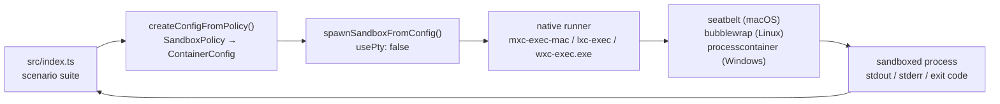
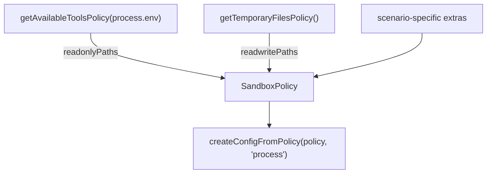

# sandbox-mxc-sdk-typescript

Experiment exercising **MXC** (Microsoft eXecution Containers) through the
[`@microsoft/mxc-sdk`](https://www.npmjs.com/package/@microsoft/mxc-sdk)
TypeScript SDK — see [microsoft/mxc](https://github.com/microsoft/mxc).

MXC runs untrusted code (model output, plugins, tools) inside an OS-native
sandbox driven by a versioned JSON policy. The same cross-platform
`SandboxPolicy` maps to `processcontainer` on Windows, `bubblewrap` on Linux,
and `seatbelt` on macOS.

> ⚠️ MXC is an **early preview**. Upstream explicitly states that generated
> policies are currently overly permissive and that **no MXC profile should be
> treated as a security boundary** yet. This experiment measures behaviour, it
> does not certify containment.

## What this experiment does

`pnpm dev` builds one policy per scenario and asserts the sandbox actually
enforces it — it is a self-checking probe, not just a demo.

| Scenario | Expectation |
|----------|-------------|
| `hello-world` | a trivial command runs inside the sandbox |
| `fs-write-allowed` | writing into `readwritePaths` succeeds |
| `fs-write-denied` | writing anywhere else fails with `EPERM` |
| `fs-read-denied` | reading `~/.ssh` fails with `EPERM` |
| `net-denied` | `fetch()` fails with `allowOutbound: false` |
| `net-allowed` | `fetch()` returns `HTTP 200` when the policy opts in |
| `extra-path-denied` | a host dir absent from the policy is unreadable |
| `extra-path-granted` | the same dir is readable once added to `readonlyPaths` |
| `readonly-stays-readonly` | a `readonlyPaths` grant still refuses writes |

## Architecture



Policy inputs come from two SDK discovery helpers:



## Requirements

- Node.js ≥ 18 (tested on 24)
- pnpm
- A host MXC supports: Windows 11 24H2+, Linux with `bwrap`, or macOS ARM64

## Run it

```bash
pnpm install

pnpm probe   # what backends/paths does this host expose?
pnpm hello   # the upstream README sample, adapted to run
pnpm dev     # the full scenario suite (exit code 0 = all as expected)
```

## Sample output (macOS ARM64, Seatbelt)

```
=== MXC platform support ===
host      : darwin/arm64
supported : true
backends  : seatbelt

--- fs-read-denied: reading sensitive host paths (~/.ssh) is refused
  PASS  exit=1
      Error: EPERM: operation not permitted, scandir '/Users/cv/.ssh'

--- net-denied: outbound network is blocked with allowOutbound: false
  PASS  exit=7
      blocked: fetch failed

--- net-allowed: outbound network works when the policy opts in
  PASS  exit=0
      HTTP 200

=== 9/9 scenarios behaved as expected ===
```

## Findings

Things the upstream sample does not spell out, learned the hard way here:

1. **`0.6.0-alpha` does not work on macOS.** Seatbelt requires schema
   `0.7.0-alpha` or later, so the README snippet fails on a Mac as written.
   This experiment pins `0.7.0-alpha`, which every stable backend accepts.
   (`0.8.0-alpha` is the current stable version but swaps `network.allowOutbound`
   for the directional `network.egress` / `network.ingress` shape.)

2. **The sandbox does not inherit `process.env`.** A bare `python` in
   `commandLine` is resolved against the backend's default `PATH`, not your
   shell's. On macOS that resolves to the `/usr/bin/python3` Xcode stub, which
   then dies trying to `dlopen` `libxcrun.dylib` — a confusing failure that
   looks like a sandbox bug but is really a PATH issue. **Use absolute
   interpreter paths.**

3. **Same reason, `os.tmpdir()` lies inside the sandbox.** Without `TMPDIR`
   in the environment, Node falls back to `/tmp`, which is *not* in
   `getTemporaryFilesPolicy().readwritePaths` (that returns the per-user
   `/var/folders/.../T/`). Pass the policy's writable path in explicitly.

4. **A binary on `PATH` is not enough — its libraries must be reachable too.**
   A pyenv-installed `python3` failed with
   `Library not loaded: /opt/homebrew/opt/gettext/lib/libintl.8.dylib` because
   `getAvailableToolsPolicy` grants `PATH` entries, not the Homebrew `lib`
   trees they link against. Adding `/opt/homebrew` to `readonlyPaths` fixed it.

5. **Enforcement itself is solid on Seatbelt** for the cases tested: filesystem
   reads/writes outside the policy, and outbound network under
   `allowOutbound: false`, all fail closed. `readonlyPaths` grants are genuinely
   read-only.

6. **Pipe mode is the better default.** `spawnSandboxFromConfig(config, { usePty: false })`
   returns a `ChildProcess` with separated `stdout`/`stderr` and a reliable exit
   code; PTY mode merges the streams.

## Files

| File | Purpose |
|------|---------|
| `src/mxc-utils.ts` | policy builder + `runInSandbox()` promise wrapper |
| `src/index.ts` | the scenario suite |
| `src/hello-sandbox.ts` | upstream README sample, adapted |
| `src/platform-probe.ts` | dumps backends and discovered policy paths |

## References

- [microsoft/mxc](https://github.com/microsoft/mxc)
- [SDK README](https://github.com/microsoft/mxc/blob/main/sdk/node/README.md)
- [Seatbelt backend guide](https://github.com/microsoft/mxc/blob/main/docs/seatbelt/seatbelt-backend.md)
- [Schema reference](https://github.com/microsoft/mxc/blob/main/docs/schema.md)
