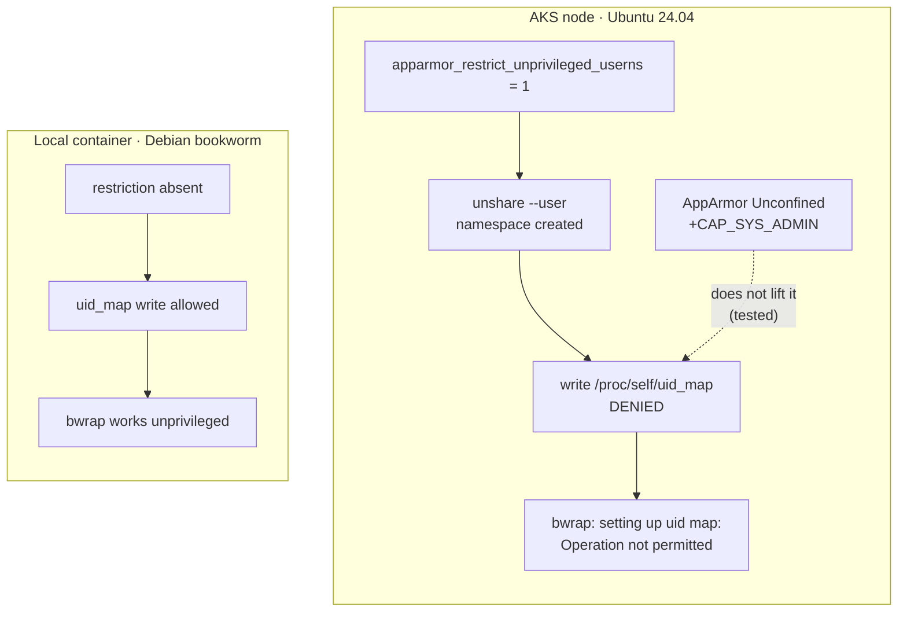

# Can AKS be configured to run MXC in pods?

Research follow-up to [kubernetes.md](./kubernetes.md), which found that MXC's
bubblewrap backend only works on `aks-scope-v2-int` with `privileged: true`.

**Short answer: yes, but only by changing the node OS.** The cheap pod-level
fix was tested and does not work, so the cleanest remaining option is a Kata
(Pod Sandboxing) node pool — which needs a different VM size than the cluster
currently uses.

> No IaC was modified and no cluster configuration was changed. Testing used
> ephemeral pods in a temporary namespace, which has been deleted.

## Root cause: an Ubuntu 24.04 kernel restriction

The earlier write-up guessed that nesting a user namespace inside Kubernetes'
own was the problem. That was close but wrong. Read from a node:

```
/proc/sys/kernel/apparmor_restrict_unprivileged_userns = 1
/proc/sys/kernel/unprivileged_userns_clone             = 1
/proc/sys/user/max_user_namespaces                     = 63848
```

`apparmor_restrict_unprivileged_userns` is the restriction Ubuntu introduced in
23.10 and enabled by default in 24.04.

Testing (see [option 3](#option-3--apparmor-unconfined-tested-does-not-work))
pinned down how it bites: **`unshare --user` succeeds**, so namespace creation
is allowed, but the subsequent write to `/proc/self/uid_map` is denied. bwrap
needs that write, which is why the error is `setting up uid map` rather than a
failure to unshare, and why neither extra capabilities nor an unconfined
AppArmor profile change the outcome.

**This also explains the platform difference.** Our local container is Debian
bookworm, which does not ship this restriction; the AKS nodes are Ubuntu 24.04,
which does. The difference was never Kubernetes versus Docker — it was the
host distribution.



## Options, ranked

| # | Option | IaC-configurable | Node pool change | Confidence |
|---|--------|------------------|------------------|------------|
| 1 | Kata Pod Sandboxing node pool | **Yes** | new pool, new VM size | High — documented, purpose-built |
| 2 | Azure Linux node pool | **Yes** | new pool | Medium — needs testing |
| 3 | ~~AppArmor `Unconfined` on the pod~~ | n/a | none | **Tested — does not work** |
| 4 | DaemonSet flipping the sysctl | Yes, but | none | Works, but a bad idea |
| 5 | Status quo: `privileged: true` | n/a | none | Works today |

### Option 1 — Kata Pod Sandboxing (recommended)

AKS ships [Pod Sandboxing](https://learn.microsoft.com/azure/aks/use-pod-sandboxing),
built on Kata Containers: each pod gets **its own kernel** in a lightweight VM.
The host's Ubuntu AppArmor restriction does not apply inside that kernel, and
the pod gains a hypervisor boundary underneath MXC — directly addressing the
"no syscall filter, kernel is shared" gap in
[threat-model.md](./threat-model.md).

Requirements, and how the current cluster measures up:

| Requirement | `aks-scope-v2-int` today | OK? |
|---|---|---|
| Kubernetes ≥ 1.27 | 1.35.7 | ✅ |
| `--os-sku AzureLinux` | all Linux pools are `Ubuntu` | ❌ new pool needed |
| Gen 2 VM with **nested virtualization** | `Standard_D2as_v4`, `Standard_D4as_v4` | ❌ see below |
| `--workload-runtime KataVmIsolation` | not set | ❌ new pool needed |

**The VM size is the real blocker.** Per the Azure size docs:

| Series | Nested virtualization |
|---|---|
| `Dasv4` (in use here) | **Not Supported** |
| `Dadsv5` | **Supported** |

So a Kata pool cannot simply reuse the existing size. `Standard_D4ads_v5` is
the closest equivalent to the current `Standard_D4as_v4` — same vendor, same
vCPU/memory shape, nested virt supported.

Usage is then a one-line pod change, and it composes with everything already
measured:

```yaml
spec:
  runtimeClassName: kata-vm-isolation
```

Known limitations: no host-network access, reduced IOPS on Azure Files and
local SSD, and Defender for Containers does not assess Kata pods.

### Option 2 — Azure Linux node pool without Kata

Azure Linux 3.0 does not ship Ubuntu's `apparmor_restrict_unprivileged_userns`
patch, so unprivileged bwrap would likely work with `hostUsers: false` and no
privilege at all — the same posture we get locally, without nested
virtualization or a VM boundary. Cheaper than option 1 and available on the
existing VM sizes.

Marked medium confidence deliberately: it follows from the root cause, but
**it has not been tested**, and this experiment has twice been wrong about what
"should" work ([findings.md](./findings.md) §7, §17). Test before relying on it.

### Option 3 — AppArmor `Unconfined`: tested, does not work

This was the cheapest option, so it was tested first. **It does not work.**

The hypothesis: the restriction is AppArmor-mediated, so running the pod
unconfined should lift it, and MXC would run on the existing node pools with no
infrastructure change at all.

Five variants, all on `aks-scope-v2-int`, each reporting its AppArmor profile,
whether it can create a user namespace, and whether bwrap can build its sandbox:

| # | AppArmor profile | Capabilities | `hostUsers` | `unshare --user` | uid_map write | bwrap |
|---|---|---|---|---|---|---|
| t1 | `cri-containerd.apparmor.d (enforce)` — control | drop `ALL` | `false` | OK | **EPERM** | fails |
| t2 | `unconfined` | drop `ALL` | `false` | OK | **EPERM** | fails |
| t3 | `unconfined` | `+SETUID,SETGID,SYS_ADMIN` | `false` | OK | **EPERM** | fails |
| t4 | `unconfined` | `+SETUID,SETGID,SYS_ADMIN` | (host) | OK | **EPERM** | fails |
| t5 | `unconfined` | **privileged** | `false` | OK | OK | **OK** |

The profile change definitely took effect — t1 reports
`cri-containerd.apparmor.d (enforce)` while t2–t4 report `unconfined` — and the
capabilities were genuinely granted: t3 reported `CapEff: 00000000002000c0`,
which decodes to exactly `CAP_SETGID | CAP_SETUID | CAP_SYS_ADMIN`.

**Neither unconfining AppArmor nor adding `CAP_SYS_ADMIN` lifts the
restriction.** Only `privileged: true` works.

#### What the test revealed about the mechanism

The failure is narrower than assumed. `unshare --user` **succeeds in every
variant** — creating a user namespace is allowed. What fails is the subsequent
write to `/proc/self/uid_map`:

```
unshare: write failed /proc/self/uid_map: Operation not permitted
bwrap: setting up uid map: Operation not permitted
```

So Ubuntu's restriction does not block namespace *creation*; it denies the
privileged uid-map write that makes the namespace usable. That is consistent
with how the restriction is implemented — the process gets its namespace but
not the authority to populate the mapping — and it explains why capabilities
granted in the parent namespace do not rescue it.

Stated conservatively: the *observations* above are measured and reproducible;
the *mechanism* is the best available explanation, and this experiment has
already been wrong twice about mechanism ([findings.md](./findings.md) §7, §17).
What matters operationally is settled either way — the pod-level fix is ruled
out, and the remaining options all change the node OS.

### Option 4 — DaemonSet setting the sysctl (not recommended)

The AKS custom node configuration docs sanction a DaemonSet for settings
outside the supported subset. It would work:
`kernel.apparmor_restrict_unprivileged_userns=0`.

Don't. It disables a host-wide kernel hardening control for **every** pod on
the node, to accommodate one workload — the opposite of what an isolation
experiment should be advocating. Options 1–3 are all narrower.

### What is *not* possible via IaC

`linuxOSConfig.sysctls` accepts only a **fixed named allowlist**
(`netCoreSomaxconn`, `netIpv4TcpTwReuse`, `vmMaxMapCount`, …), not arbitrary
kernel parameters — `kernel.apparmor_restrict_unprivileged_userns` is not among
them. Likewise `allowedUnsafeSysctls` in the kubelet config only governs
*namespaced* sysctls a pod may set for itself, and this one is host-global.

**So the sysctl cannot be set through AKS IaC.** The supported paths are a
different OS SKU (options 1–2), a pod-level profile (option 3), or a DaemonSet
(option 4).

## Bonus: CPU reservation is directly supported

[findings.md](./findings.md) §16 found that a shared CFS quota starves the
trusted side and that exclusive cores fix it. AKS exposes exactly that through
custom kubelet configuration:

```json
{ "cpuManagerPolicy": "static" }
```

With `cpuManagerPolicy: static`, a Guaranteed-QoS pod (integer CPU,
`requests == limits`) gets **exclusive** cores — the Kubernetes-native
equivalent of the `mxc-reserved` compose profile, and configurable per node
pool via `--kubelet-config`.

## Recommendation

1. ~~Test option 3 first~~ — **done, and ruled out.** No pod-level setting
   avoids `privileged` on these Ubuntu 24.04 node pools.
2. **If MXC is going to run untrusted code on AKS for real, use option 1.** A
   dedicated `KataVmIsolation` node pool on `Standard_D4ads_v5` + AzureLinux
   gives each pod its own kernel, which is a genuine answer to the shared-kernel
   exposure in [threat-model.md](./threat-model.md) rather than a workaround for
   an AppArmor rule. Pair it with `cpuManagerPolicy: static`.
3. **Avoid option 4**, and treat option 5 (`privileged: true`) as
   experiment-only.

Note that options 1 and 2 both require a **new node pool**, which is an
additive IaC change in `growth-ecosystems/scope-core-infra` — no modification
to existing pools, and it can be tainted so only MXC workloads land on it.

## Sources

- [Pod Sandboxing with AKS](https://learn.microsoft.com/azure/aks/use-pod-sandboxing)
- [Secure container access — user namespaces, AppArmor, seccomp](https://learn.microsoft.com/azure/aks/secure-container-access)
- [Customize node configuration for AKS node pools](https://learn.microsoft.com/azure/aks/custom-node-configuration)
- [Dasv4 sizes series](https://learn.microsoft.com/azure/virtual-machines/sizes/general-purpose/dasv4-series) — nested virtualization not supported
- [Dadsv5 sizes series](https://learn.microsoft.com/azure/virtual-machines/sizes/general-purpose/dadsv5-series) — nested virtualization supported
