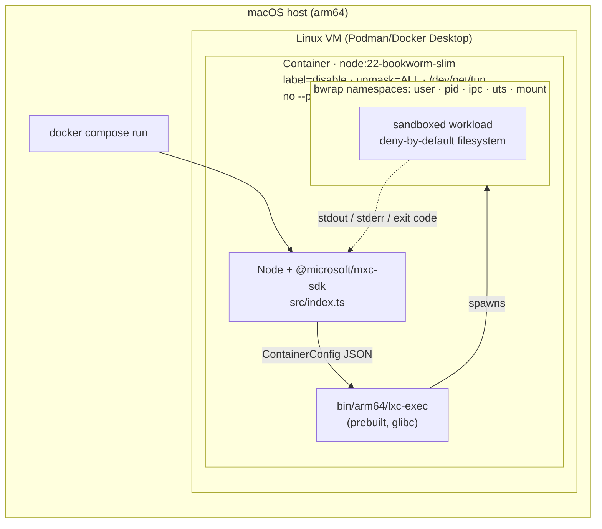
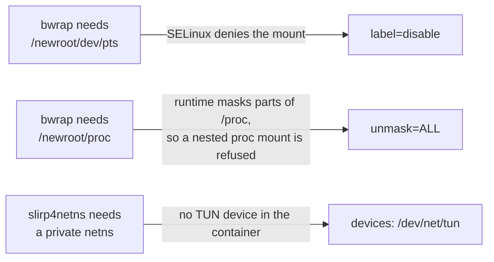
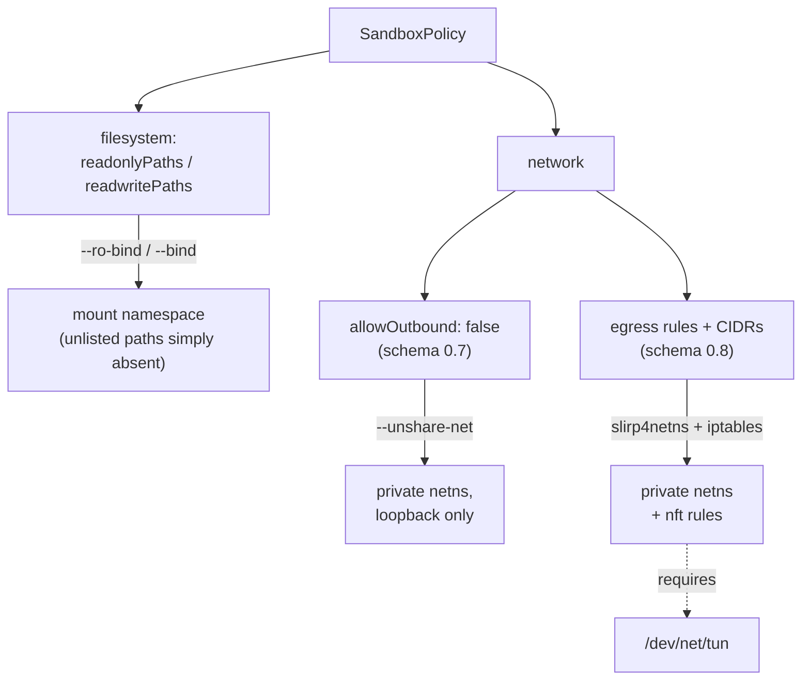

# Running in Docker

On Linux, MXC uses the **`bubblewrap`** backend, which builds its sandbox from
user namespaces and mount operations. Container runtimes restrict exactly those
operations, so a stock container cannot run it.

```bash
# Works — minimum viable configuration
docker compose run --rm mxc

# Fails — stock container hardening, kept to show the failure mode
docker compose run --rm mxc-stock

# Works — but grants far more than MXC needs
docker compose run --rm mxc-privileged
```

## Minimum requirements

**In the image**

- a **glibc** base — the SDK ships a prebuilt glibc `lxc-exec`, and Alpine
  fails even with `gcompat` ([findings.md](./findings.md) §13)
- `bubblewrap` ≥ 0.5.0 (bookworm ships 0.8.0)
- Node ≥ 18

`slirp4netns`, `iptables` and `uidmap` are only needed for schema 0.8
private-namespace network modes — see [Network policy](#network-policy) below.

**At runtime**

`mxc` is **not privileged and adds no capabilities**. It needs exactly two
`security_opt` entries plus one device:

| Option | Failure it fixes |
|--------|------------------|
| `label=disable` | `bwrap: Can't mount devpts on /newroot/dev/pts: Permission denied` — SELinux denies the devpts mount |
| `unmask=ALL` | `bwrap: Can't mount proc on /newroot/proc: Operation not permitted` — the runtime masks parts of `/proc`, and the kernel refuses a nested `proc` mount unless a fully visible instance exists |
| `devices: /dev/net/tun` | `open("/dev/net/tun"): No such file or directory` — only for per-CIDR egress rules |

**On the kernel:** user namespaces enabled (3.8+).

## What did not help

Each of these was tested individually against a `bwrap` smoke test and made
**no** difference:

```
opts=[none]                                        -> Can't mount devpts ... Permission denied
opts=[--cap-add SYS_ADMIN]                         -> Can't mount devpts ... Permission denied
opts=[--security-opt seccomp=unconfined]           -> Can't mount devpts ... Permission denied
opts=[--security-opt seccomp=unconfined --cap-add SYS_ADMIN]
                                                   -> Can't mount devpts ... Permission denied
opts=[--cap-add ALL]                               -> Can't mount devpts ... Permission denied
opts=[--user 1000]                                 -> Can't mount devpts ... Permission denied
opts=[--privileged]                                -> ok
opts=[--security-opt label=disable]                -> Can't mount proc ... Operation not permitted
opts=[--security-opt label=disable --security-opt unmask=ALL]
                                                   -> ok
opts=[--security-opt label=disable --security-opt unmask=ALL --user 1000]
                                                   -> ok
```

It is a mount-visibility problem, not a capability or syscall-filter one — and
it works fine as a non-root user.

`unmask=ALL` is Podman syntax. On Docker Engine the nearest equivalent is
`--security-opt systempaths=unconfined`; this Podman host accepted that option
but did not honour it, so it still failed here and remains unverified on Docker
Engine proper.

## Architecture

Four nested boundaries on a Mac. The container is a genuine second layer — the
sandbox's "host" is the container filesystem, not your laptop.



Why each `security_opt` is required, mapped to the layer it unblocks:



## Network policy

The filesystem policy and the network policy take different paths. Only the
schema 0.8 per-CIDR rules need the TUN device and the private network
namespace — which is why the earlier `allowOutbound: false` tests passed long
before `/dev/net/tun` was added:



## Results

Debian bookworm, bwrap 0.8.0, arm64:

```
host      : linux/arm64
supported : true
backends  : bubblewrap

--- fs-write-contained: a write outside readwritePaths never reaches the host
  PASS  write redirected into the sandbox (exit=0); host file absent

--- fs-read-denied: reading sensitive host paths (~/.ssh) is refused
  SKIP  /root/.ssh does not exist on this host

--- readonly-stays-readonly: a readonlyPaths grant does not allow writes ...
  PASS  exit=1
      Error: EROFS: read-only file system, open '/app/.fixture-tQivdO/tampered.txt'

=== 8 passed, 0 failed, 0 errored, 1 skipped ===
```

Adversarial probes in the same container:

```
--- network-allowlist: block the internet except one site, then reach a different site anyway
  CONTAINED  allowlisted 172.66.147.243 reachable, 104.18.24.232 blocked (exit=7)

--- timeout-enforced: ignore timeoutMs and run forever (resource exhaustion)
  ESCAPED  exit=255 after 60.1s (timeoutMs=5)

=== 7/8 probes contained, 1 escaped, 0 unsupported by this backend ===
```

The `mxc-stock` profile aborts honestly instead of faking passes:

```
--- hello-world: runs a trivial command inside the sandbox
  ERROR  sandbox did not start: bwrap: Can't mount devpts on /newroot/dev/pts: Permission denied

The baseline scenario could not start a sandbox — aborting.
```

## Build behind a proxy

If npmjs.org is unreachable from your build network:

```bash
docker compose build --build-arg NPM_REGISTRY=https://your-proxy/npm/ mxc
```
