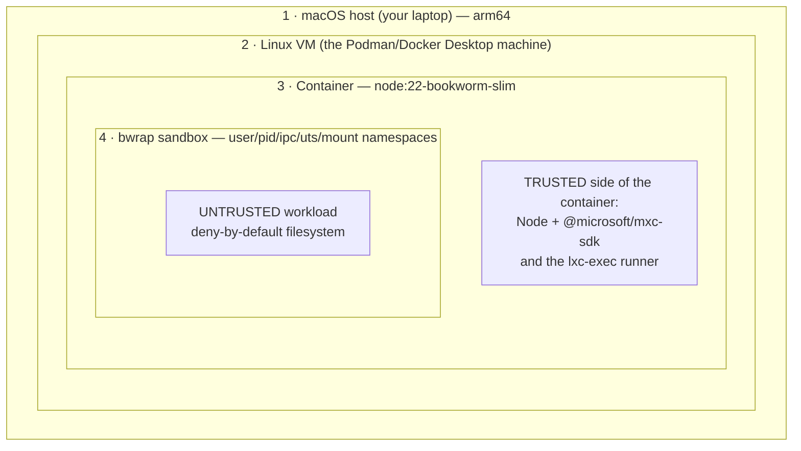
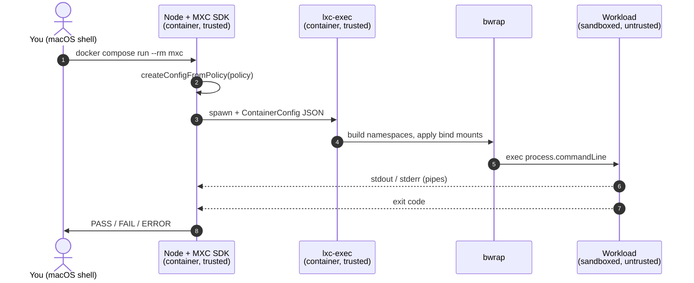
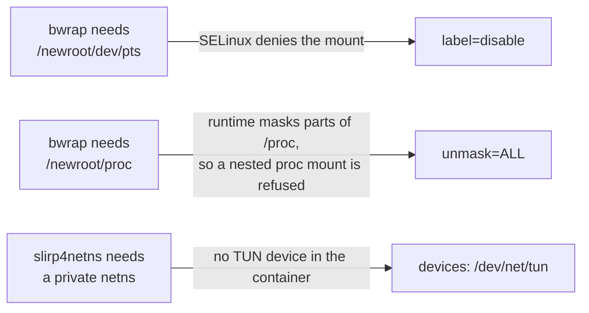
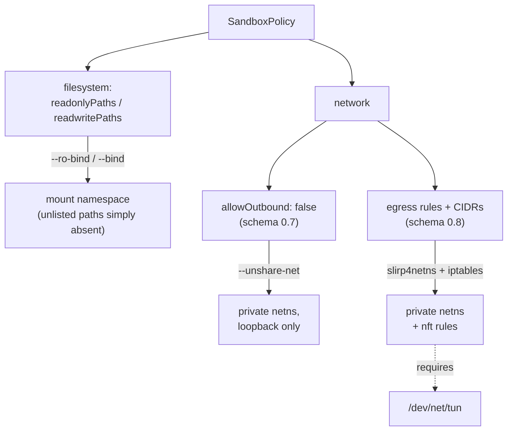
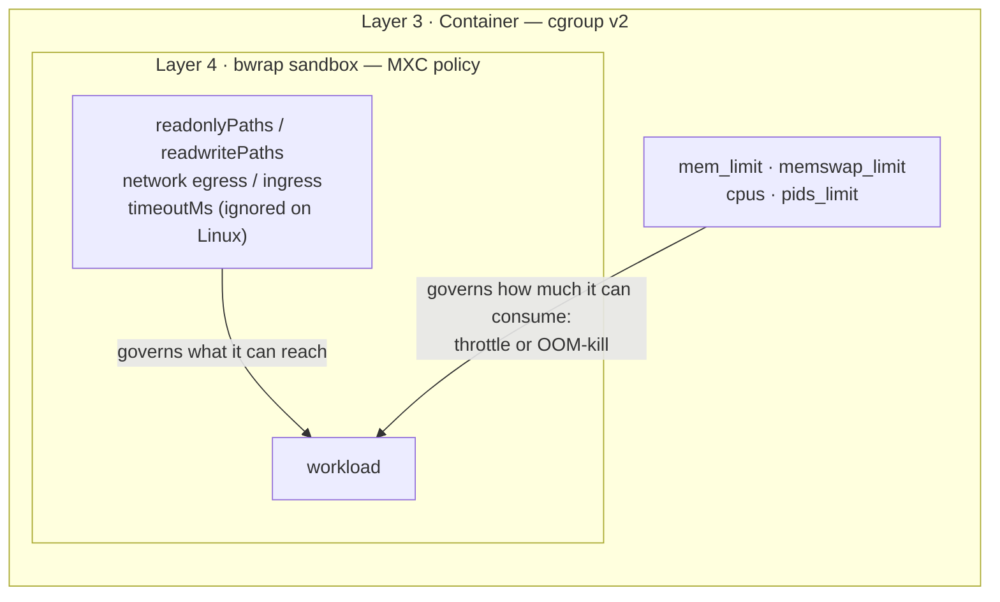
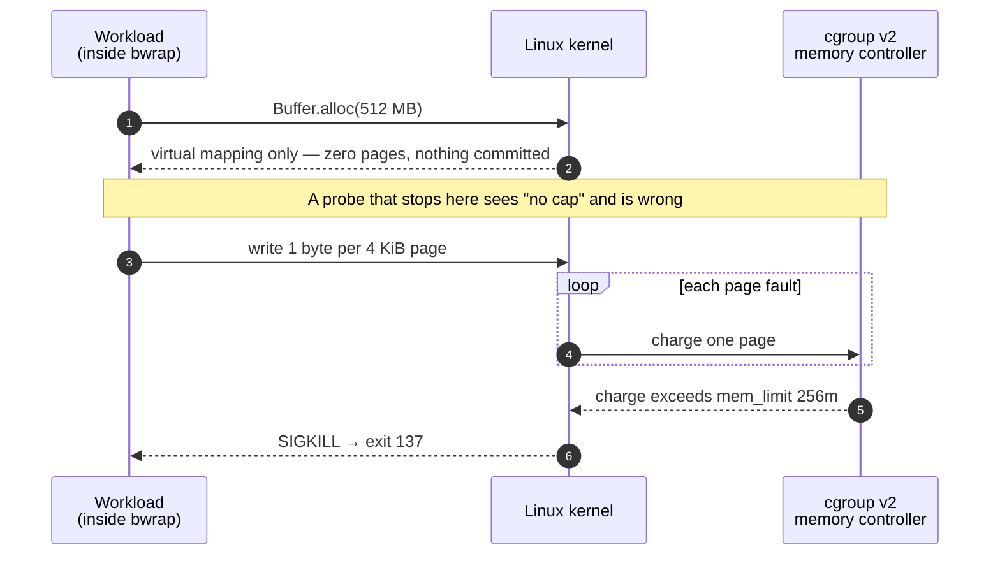

# Running in Docker

On Linux, MXC uses the **`bubblewrap`** backend, which builds its sandbox from
user namespaces and mount operations. Container runtimes restrict exactly those
operations, so a stock container cannot run it.

```bash
# Works — minimum viable configuration
docker compose run --rm mxc

# Fails — stock container hardening, kept to show the failure mode
docker compose run --rm mxc-stock

# Works — but grants far more than MXC needs
docker compose run --rm mxc-privileged

# Adds the CPU/memory caps MXC itself cannot express
docker compose run --rm mxc-limits

# Caps the workload WITHOUT starving the orchestrator (preferred)
docker compose run --rm mxc-reserved
```

## Minimum requirements

**In the image**

- a **glibc** base — the SDK ships a prebuilt glibc `lxc-exec`, and Alpine
  fails even with `gcompat` ([findings.md](./findings.md) §14)
- `bubblewrap` ≥ 0.5.0 (bookworm ships 0.8.0)
- Node ≥ 18

`slirp4netns`, `iptables` and `uidmap` are only needed for schema 0.8
private-namespace network modes — see [Network policy](#network-policy) below.

**At runtime**

`mxc` is **not privileged and adds no capabilities**. It needs exactly two
`security_opt` entries plus one device:

| Option | Failure it fixes |
|--------|------------------|
| `label=disable` | `bwrap: Can't mount devpts on /newroot/dev/pts: Permission denied` — SELinux denies the devpts mount |
| `unmask=ALL` | `bwrap: Can't mount proc on /newroot/proc: Operation not permitted` — the runtime masks parts of `/proc`, and the kernel refuses a nested `proc` mount unless a fully visible instance exists |
| `devices: /dev/net/tun` | `open("/dev/net/tun"): No such file or directory` — only for per-CIDR egress rules |

**On the kernel:** user namespaces enabled (3.8+).

## What did not help

Each of these was tested individually against a `bwrap` smoke test and made
**no** difference:

```
opts=[none]                                        -> Can't mount devpts ... Permission denied
opts=[--cap-add SYS_ADMIN]                         -> Can't mount devpts ... Permission denied
opts=[--security-opt seccomp=unconfined]           -> Can't mount devpts ... Permission denied
opts=[--security-opt seccomp=unconfined --cap-add SYS_ADMIN]
                                                   -> Can't mount devpts ... Permission denied
opts=[--cap-add ALL]                               -> Can't mount devpts ... Permission denied
opts=[--user 1000]                                 -> Can't mount devpts ... Permission denied
opts=[--privileged]                                -> ok
opts=[--security-opt label=disable]                -> Can't mount proc ... Operation not permitted
opts=[--security-opt label=disable --security-opt unmask=ALL]
                                                   -> ok
opts=[--security-opt label=disable --security-opt unmask=ALL --user 1000]
                                                   -> ok
```

It is a mount-visibility problem, not a capability or syscall-filter one — and
it works fine as a non-root user.

`unmask=ALL` is Podman syntax. On Docker Engine the nearest equivalent is
`--security-opt systempaths=unconfined`; this Podman host accepted that option
but did not honour it, so it still failed here and remains unverified on Docker
Engine proper.

## Architecture

Two separate things are easy to confuse here, so they get two diagrams:
**where things live** (nesting) and **what calls what** (flow).

### 1a. Nesting — which boundary is inside which

No arrows: this is purely containment. Each numbered layer is fully inside the
one above it.



The detail that matters: **the SDK and the `lxc-exec` runner live in layer 3,
outside the sandbox they create.** Only the workload is inside layer 4. So the
sandbox protects the container from the workload, and the container protects
the VM (and your Mac) from everything above it. Two independent layers — a
policy mistake in layer 4 is still caught by layer 3.

### 1b. Flow — what calls what, in order

Same components, now ordered in time rather than by nesting.



Reading the two together: steps 1–4 all happen in layer 3; step 5 is the moment
execution crosses into layer 4; steps 6–7 are the only data coming back out,
and they are just bytes on a pipe.

Why each `security_opt` is required, mapped to the layer it unblocks:



## Network policy

The filesystem policy and the network policy take different paths. Only the
schema 0.8 per-CIDR rules need the TUN device and the private network
namespace — which is why the earlier `allowOutbound: false` tests passed long
before `/dev/net/tun` was added:



## Results

Debian bookworm, bwrap 0.8.0, arm64:

```
host      : linux/arm64
supported : true
backends  : bubblewrap

--- fs-write-contained: a write outside readwritePaths never reaches the host
  PASS  write redirected into the sandbox (exit=0); host file absent

--- fs-read-denied: reading sensitive host paths (~/.ssh) is refused
  SKIP  /root/.ssh does not exist on this host

--- readonly-stays-readonly: a readonlyPaths grant does not allow writes ...
  PASS  exit=1
      Error: EROFS: read-only file system, open '/app/.fixture-tQivdO/tampered.txt'

=== 8 passed, 0 failed, 0 errored, 1 skipped ===
```

Adversarial probes in the same container:

```
--- network-allowlist: block the internet except one site, then reach a different site anyway
  CONTAINED  allowlisted 172.66.147.243 reachable, 104.18.24.232 blocked (exit=7)

--- timeout-enforced: ignore timeoutMs and run forever (resource exhaustion)
  ESCAPED  exit=255 after 60.1s (timeoutMs=5)

=== 7/8 probes contained, 1 escaped, 0 unsupported by this backend ===
```

The `mxc-stock` profile aborts honestly instead of faking passes:

```
--- hello-world: runs a trivial command inside the sandbox
  ERROR  sandbox did not start: bwrap: Can't mount devpts on /newroot/dev/pts: Permission denied

The baseline scenario could not start a sandbox — aborting.
```

## Resource limits

MXC has no CPU, memory or process-count field on any cross-platform backend
([findings.md](./findings.md) §12), so the container is the only place to
enforce them.

### Which layer owns which control

The two layers from [1a](#1a-nesting--which-boundary-is-inside-which) divide
the work. MXC governs what the workload can *touch*; the cgroup governs how
much it can *consume*. Neither covers the other:



Read that as a division of responsibility, not a fallback: a memory bomb is
invisible to MXC, and a path traversal is invisible to the cgroup.

### How the memory kill actually lands

The enforcement point is the page fault, not the allocation — which is exactly
why the first version of the probe measured nothing
([findings.md](./findings.md) §12):



CPU is throttled rather than killed: the workload keeps running, but the
scheduler caps its share, which is why `cpus: 0.5` shows up as the achieved
parallelism falling from ~5.6 cores to ~0.5 instead of the process dying.

### Configuration

The `mxc-limits` profile:

```yaml
mem_limit: 256m
memswap_limit: 256m
cpus: 0.5
pids_limit: 128
```

Uncapped, a sandboxed workload does as it pleases:

```
ESCAPED  memory: 512MB committed, uncapped; cpu: 5.63/6 cores, uncapped
```

Under `mxc-limits` the cgroup does what MXC cannot — the memory cap lands
first, so the process never even reports:

```
CONTAINED  memory: OOM-killed (exit=137) by an out-of-band cap
```

With only a CPU quota applied, the probe reports the measured allowance, which
tracks the configured value closely: `--cpus 0.5` → `~0.5 of 6 cores demanded`,
`--cpus 2` → `~2.03 of 6`, `--cpus 4` → `~3.98 of 6`. See
[findings.md](./findings.md) §12 for how the measurement works.

### Keeping the trusted side responsive

A `cpus:` quota is shared by everything in the container, so capping it
throttles the orchestrator alongside the workload. Measured with `pnpm latency`
under `--cpus 1`, the trusted side's 20ms service loses 60% of its ticks; with
`cpuset` plus a reserved core it loses none:

| Configuration | trusted work vs idle | ticks served |
|---|---|---|
| `cpus: 1` (shared quota) | 5.3x slower | 40% |
| `cpuset: 0-3` + `reserveHostCpu` | 1.0x — unaffected | 97% |

The `mxc-reserved` profile is the working shape; see
[findings.md](./findings.md) §16.

## Build behind a proxy

If npmjs.org is unreachable from your build network:

```bash
docker compose build --build-arg NPM_REGISTRY=https://your-proxy/npm/ mxc
```
