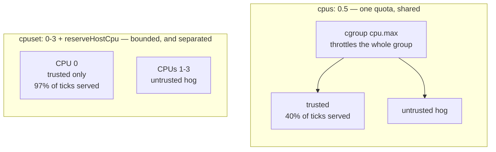

# Findings

Running log for the `sandbox-mxc-sdk-typescript` experiment. See
[README.md](./README.md) for the format and the rules that keep it honest.

**Environment unless stated otherwise:** macOS 15 arm64 (Seatbelt backend) and
Debian bookworm arm64 in a container (Bubblewrap backend, bwrap 0.8.0),
`@microsoft/mxc-sdk` 0.8.0, Node 22/24.

---

## Getting the upstream sample to run

### 1. `0.6.0-alpha` does not work on macOS

**What happened** — the schema version in the upstream README sample is below
the floor the macOS backend accepts.

**Evidence** — Seatbelt requires schema `0.7.0-alpha` or later
([backend docs](https://github.com/microsoft/mxc/blob/main/docs/seatbelt/seatbelt-backend.md)),
while ProcessContainer and Bubblewrap accept `0.6.0-alpha`.

**Takeaway** — this experiment pins `0.7.0-alpha`, the lowest version all three
stable backends accept. `0.8.0-alpha` is current but swaps
`network.allowOutbound` for the directional `network.egress` / `network.ingress`
shape, so the two cannot be mixed in one config.

### 2. The sandbox does not inherit `process.env`

**What happened** — a bare `python` in `commandLine` resolved against the
backend's default `PATH`, not the shell's, landing on the `/usr/bin/python3`
Xcode stub.

**Evidence**

```
xcrun: error: unable to load libxcrun (dlopen(/Applications/Xcode.app/Contents/Developer/usr/lib/libxcrun.dylib, 0x0005):
  tried: '/Applications/Xcode.app/Contents/Developer/usr/lib/libxcrun.dylib' (file system sandbox blocked open()) ...
exit: 1
```

**Takeaway** — use absolute interpreter paths. The failure reads like a sandbox
bug but is a `PATH` resolution issue; the SDK never copies `process.env` into
the child.

### 3. `os.tmpdir()` lies inside the sandbox

**What happened** — with no `TMPDIR` in the environment (see finding 2), Node
falls back to `/tmp`, which is *not* what the policy granted.

**Evidence** — `getTemporaryFilesPolicy().readwritePaths` returns the per-user
`/var/folders/.../T/` on macOS, so writing to `/tmp` failed:

```
Error: EPERM: operation not permitted, open '/tmp/mxc-demo.txt'
```

**Takeaway** — pass the policy's writable path into the sandboxed command
explicitly instead of letting the child discover it.

### 4. A binary on `PATH` is not enough — its libraries must be reachable

**What happened** — a pyenv-installed `python3` was on `PATH` and still would
not start.

**Evidence**

```
dyld[73526]: Library not loaded: /opt/homebrew/opt/gettext/lib/libintl.8.dylib
  Referenced from: /Users/cv/.pyenv/versions/3.11.8/bin/python3.11
```

Adding `/opt/homebrew` to `readonlyPaths` fixed it:

```
exit= 0 out= "hello from sandboxed python"
```

**Takeaway** — `getAvailableToolsPolicy` grants `PATH` entries, not the
library trees those binaries link against. Grant the dependency roots too.

### 5. Pipe mode is the better default

**What happened** — `spawnSandboxFromConfig(config, { usePty: false })` returns
a `ChildProcess` with separated `stdout`/`stderr` and a reliable exit code.
PTY mode (the default) merges the streams.

**Takeaway** — use pipe mode for anything programmatic.

---

## Enforcement behaviour

### 6. Enforcement is solid on Seatbelt for the cases tested

**What happened** — filesystem reads/writes outside the policy and outbound
network under `allowOutbound: false` all fail closed, and `readonlyPaths`
grants are genuinely read-only.

**Evidence** — `pnpm dev` on macOS: `9 passed, 0 failed, 0 errored, 0 skipped`.
Adversarial follow-up in [threat-model.md](./threat-model.md).

### 7. `getPlatformSupport()` is optimistic

**What happened** — the probe reported the backend as available on hosts where
every spawn failed.

**Evidence** — inside stock Docker:

```
supported : true
backends  : bubblewrap
```

…yet every sandbox died at `bwrap: Can't mount devpts on /newroot/dev/pts`.
Seen a second time on Alpine (finding 11), where it again reported
`isSupported: true, backends: ['bubblewrap']` while nothing could run. The
probe only executes `bwrap --version`.

**Takeaway** — treat it as necessary, not sufficient. Run a real smoke-test
sandbox at startup. The scenario suite now aborts with exit code 3 if the
baseline `hello-world` cannot start.

### 8. The two backends deny differently, and a naive test cannot tell

**What happened** — the original `fs-write-denied` scenario asserted "writing
outside `readwritePaths` exits non-zero". That passed on Seatbelt and *failed*
on Bubblewrap — for a reason that was not a containment failure at all.

**Evidence** — Seatbelt denies the syscall on the real path:

```
Error: EPERM: operation not permitted, open '.../escape.txt'
```

Bubblewrap is deny-by-default *by omission* — unlisted paths do not exist in
the namespace, so the write succeeded into a throwaway mount namespace:

```
FAIL  exit=0
      escaped
```

**Takeaway** — corrected in place: `fs-write-denied` was replaced by
`fs-write-contained`, which asserts the **host file is absent afterwards**.
That is the property that actually matters, and it holds on both backends.
Reads differ the same way (`EPERM` vs `ENOENT`), so assert on disclosure, not
on the error code.

### 9. `timeoutMs` is silently ignored on Bubblewrap

**What happened** — Seatbelt kills the workload on schedule; Bubblewrap lets it
run to completion.

**Evidence** — Seatbelt, 60s sleep under a 5s budget:

```
CONTAINED  exit=255 after 5.0s (timeoutMs=5)
```

Bubblewrap, same policy:

```
ESCAPED  exit=255 after 60.1s (timeoutMs=5)
```

Reproduced with shorter budgets — a 20s workload printed `alive` after 20.1s
under both a 2s and a 5s budget. The call returns `exit=255`, which *looks*
like a timeout but only arrives after the workload finishes.

**Takeaway** — do not rely on `timeoutMs` as a resource control on Linux.
Enforce your own deadline around the child process.

### 10. No syscall filtering is applied by either backend

**What happened** — measured rather than assumed, by reading
`/proc/self/status` from inside the sandbox with the container's own seccomp
profile disabled.

**Evidence**

```
container: Seccomp:	0
status: CapEff:	00000000800405fb | NoNewPrivs:	1 | Seccomp:	0 | Seccomp_filters:	0
```

(With the container's default profile active the same read shows
`Seccomp: 2, Seccomp_filters: 1` — that one filter is the *runtime's*, not
MXC's.)

**Takeaway** — MXC here is a filesystem and namespace boundary, not a syscall
boundary. The full kernel attack surface stays reachable, so a kernel LPE
defeats it.

### 11. "Allow only this one site" is Linux-only

**What happened** — the `network-allowlist` probe asks for schema 0.8
default-deny egress with a single `/32` + `tcp/80` allow rule.

**Evidence** — Seatbelt rejects it at config time:

```
UNSUPPORTED  backend rejected per-CIDR egress rules:
  network.egress allow/deny rules are not supported by the selected backend
```

Bubblewrap enforces it:

```
CONTAINED  allowlisted 172.66.147.243 reachable, 104.18.24.232 blocked (exit=7)
```

**Takeaway** — macOS has no packet-filter primitive; Seatbelt's `(remote ...)`
accepts only `*` and `localhost`, making outbound an on/off switch plus a
loopback exception. It fails closed at config time rather than quietly ignoring
the rule, which is the right failure mode. Rules take IP literals/CIDRs only —
DNS names are rejected at validation rather than resolved, because the sandbox
resolves names itself and could otherwise be handed an address the rules never
authorised. For hostname allowlisting you need a proxy
(`runtimeConfig.networkProxy`), and MXC only confines egress *to* the proxy —
actually speaking HTTP to it is cooperative, not enforced.

### 12. CPU and memory cannot be contained by MXC — use cgroups

**What happened** — MXC expresses **no** CPU, memory, or process-count limit
for the cross-platform backends. `timeoutMs` (wall clock) is the only resource
control in the schema, and it is not even enforced on Bubblewrap (§9).

**Evidence** — the SDK's `ContainerConfig` has no such field. The only
occurrences anywhere in the type definitions are:

```
279:    /** Number of CPUs allocated to the WSLC session */
280:    cpuCount?: number;
281:    /** Memory in MB allocated to the WSLC session */
282:    memoryMb?: number;
```

…and those belong to `WslcConfig` — Windows-only, experimental, requiring
schema `0.9.0-alpha` plus `experimental: true`. `LxcConfig`, `SeatbeltConfig`
and `ProcessConfig` have nothing comparable.

### How the probe works

Saturation is attempted with **one spinner thread per visible core**, each
running a tight `while (Date.now() < end)` loop for 1s in a `worker_threads`
Worker. The measurement is the ratio of CPU-time burned to wall-time elapsed,
taken from `process.cpuUsage()` (which the kernel reports via `getrusage`):

```js
const demand = os.cpus().length;              // spinners == visible cores
const ws = Array.from({ length: demand }, () => new Worker(spinSrc, { eval: true }));
// ...after all workers exit:
const achieved = (c.user + c.system) / 1000 / wall;   // cores actually obtained
```

A ratio of 4.0 means four cores' worth of CPU was consumed in one wall-second,
i.e. the workload really did run on four cores at once. Memory is probed
separately by committing a 512 MB buffer one byte per 4 KiB page.

**Evidence.** macOS/Seatbelt, nothing capping it:

```
ESCAPED  memory: 512MB committed, uncapped; cpu: 10.23/12 cores, uncapped
```

Container/Bubblewrap, no cgroup limits:

```
ESCAPED  memory: 512MB committed, uncapped; cpu: 5.63/6 cores, uncapped
```

Under a cgroup CPU quota the probe reports the *measured* allowance, and it
tracks the configured value closely across the range:

| `--cpus` | Reported |
|---------:|----------|
| (none) | `5.63/6 cores, uncapped` |
| 0.5 | `throttled to ~0.5 of 6 cores demanded` |
| 1 | `throttled to ~1.03 of 6` |
| 2 | `throttled to ~2.03 of 6` |
| 4 | `throttled to ~3.98 of 6` |

With `--memory 256m` the process never reports at all — the OOM killer gets it
first:

```
CONTAINED  memory: OOM-killed (exit=137) by an out-of-band cap
```

**Takeaway** — resource containment must come from a layer *outside* MXC. The
`mxc-limits` compose profile shows the shape:

```yaml
mem_limit: 256m
memswap_limit: 256m
cpus: 0.5
pids_limit: 128
```

This is the strongest practical argument for running MXC inside a container
(§15): the container supplies exactly the control MXC lacks. On a bare macOS
host there is no equivalent — Seatbelt has no resource-limit primitive, so
untrusted code can allocate and spin freely until the machine suffers.

**Two probe bugs worth recording** — both produced a confidently wrong answer,
which is the failure mode that matters in a measurement harness:

1. **Memory was never committed.** The first version allocated 512 MB with
   `Buffer.alloc()` and touched only the first and last byte. Those are
   lazily-mapped zero pages, so nothing was charged to the cgroup and the probe
   reported "no cap" even under `--memory 256m`. Writing one byte per 4 KiB
   page made the OOM kill appear immediately. *A resource test that does not
   commit the resource measures nothing.*

2. **CPU demand was hardcoded, and the two resources shared one verdict.** The
   spinner count was fixed at 4 and "capped" was `ratio < 1.5`, so any quota at
   or above ~2 cores was indistinguishable from no quota at all — `--cpus 2`
   dutifully reported `2.01x parallel` and was scored **ESCAPED**. Worse, the
   memory and CPU results were collapsed into a single boolean, so an uncapped
   memory result printed the words *"no cap"* on a host where CPU was in fact
   throttled to 0.5 cores. Fixed by scaling demand to `os.cpus().length`,
   comparing achieved against demand rather than a constant, and reporting the
   two resources separately.

---

## Packaging and deployment

### 13. Containers block Bubblewrap on mount visibility, not capabilities

**What happened** — a stock container cannot run the Bubblewrap backend, and
the usual privilege escalations do not fix it.

**Evidence** — the full bisect is in [docker.md](./docker.md). Summary:
`label=disable` and `unmask=ALL` are required; `--cap-add SYS_ADMIN`,
`--cap-add ALL`, `seccomp=unconfined`, `apparmor=unconfined` and running as
non-root all made no difference.

**Takeaway** — it is a mount-visibility problem. No `--privileged` and no added
capabilities are needed.

### 14. Alpine does not work — use a glibc base image

**What happened** — the SDK ships a *prebuilt glibc* `lxc-exec`, which will not
relocate against musl.

**Evidence** — `node:22-alpine` arm64, with `libc6-compat` and again with
`gcompat`:

```
Error relocating /app/node_modules/@microsoft/mxc-sdk/bin/arm64/lxc-exec: __res_init: symbol not found
exit: 127
```

```
ldd .../lxc-exec
  Error relocating .../lxc-exec: gnu_get_libc_version: symbol not found
```

**Takeaway** — use a glibc base. This experiment uses `node:22-bookworm-slim`,
which also carries bwrap 0.8.0 in the default repos.

### 15. Docker is a real second containment layer

**What happened** — because the container filesystem *is* the sandbox's host,
the blast radius of a policy mistake is the container rather than the laptop.

**Takeaway** — given that upstream does not treat MXC profiles as security
boundaries yet, running MXC inside a container is the more defensible posture
today. The two layers fail independently.

### 16. A container-wide CPU cap suffocates the trusted side too

**What happened** — §12 concluded "cap it with cgroups", and the `mxc-limits`
profile did exactly that with `cpus: 0.5`. Measuring the *orchestrator's* own
responsiveness while a sandboxed hog runs shows that advice was incomplete: a
cgroup quota applies to the whole container, so it throttles the trusted
process just as hard as the untrusted one.

**How it is measured** — `pnpm latency` (`src/trusted-latency.ts`) runs a
trusted-side "service" — a 20ms timer that performs 5ms of real SHA-256 work
each tick — and reports event-loop delay, how many ticks were served, and how
much that fixed 5ms slice stretched, while a sandboxed hog saturates every
visible core. Measuring an idle event loop would prove nothing: an
orchestrator merely awaiting a child needs almost no CPU and never looks
starved, which is why the first version of this test showed no effect at all.

**Evidence** — container held to one CPU by quota (`--cpus 1`):

```
  scenario        loop p99  work p99  stretch  served
  idle              21.2ms    18.0ms     3.6x     97%
  hog              111.0ms    95.6ms    19.1x     40%
  hog + nice 19    110.3ms   104.6ms    20.9x     39%
  hog + affinity   105.6ms   102.7ms    20.5x     54%
```

The trusted service loses **60% of its ticks**. Neither `nice 19` nor CPU
affinity rescues it, because CFS bandwidth control throttles the entire cgroup
once the quota is spent — during a throttled period nothing in the group runs,
whatever its priority.

With the same hog but no quota, the trusted side is untouched (`100%` served):
Linux already favours a low-demand task over six spinners. **The quota, not the
hog, was doing the damage.**

**What works** — bound the untrusted side by *hardware* and reserve a CPU for
the trusted one. Under `cpuset: "0-3"`, with the sandbox pinned to CPUs 1-3:

```
  scenario        loop p99  work p99  stretch  served
  idle              18.8ms    17.5ms     3.5x     97%
  hog + affinity    11.6ms     7.5ms     1.5x     97%
```

The trusted side's work is **as fast as when idle** while the sandbox saturates
three cores, and total CPU is still bounded to four.



**Takeaway** — use `cpuset` to bound total CPU and pin the sandbox off the
reserved core, rather than a `cpus:` quota that both sides share. The
`mxc-reserved` compose profile is the working configuration, and
`runInSandbox({ reserveHostCpu: true })` applies the pin — it reads
`Cpus_allowed_list` rather than `os.cpus()`, since the latter reports every
host core regardless of the container's cpuset. Keep `mem_limit`: memory is a
hard failure (OOM kill), and there the container-wide cap is the right tool.

### 17. On Kubernetes, MXC needs `privileged` — and admission cannot tell you that

**What happened** — the same image that runs unprivileged under Docker cannot
start a sandbox on AKS unless the pod is privileged.

**Evidence** — Kubernetes rejects `procMount: Unmasked` unless `hostUsers` is
false, and with that set the pod is *admitted* unprivileged with all
capabilities dropped. It then fails at runtime:

| Variant | securityContext | Result |
|---|---|---|
| userns, drop `ALL` | `procMount: Unmasked` | `bwrap: setting up uid map: Operation not permitted` |
| userns + `SETUID`,`SETGID` | `procMount: Unmasked` | identical failure |
| userns, defaults | `procMount: Unmasked` | `bwrap: Failed to make / slave: Permission denied` |
| privileged, host userns | `privileged: true` | works |
| privileged + userns | `privileged: true`, `hostUsers: false` | works |

**Root cause (found later, see [aks-enablement.md](./aks-enablement.md))** — not
the nesting itself. The AKS nodes run Ubuntu 24.04, where
`kernel.apparmor_restrict_unprivileged_userns = 1` blocks unprivileged user
namespace creation outright. Our local container is Debian bookworm, which does
not ship that restriction. The platform difference was never Kubernetes vs
Docker — it was the host distribution, and it is fixable with an AzureLinux or
Kata node pool.

**Takeaway** — use `privileged: true` **with** `hostUsers: false` so the
privilege is scoped to the pod's user namespace rather than the node. Note the
direction of the result: on this workload **AKS is a weaker posture than local
Docker**, which needs no privilege at all.

This is §7 one layer up. There the SDK's own probe claimed a backend was
available on a host where nothing could spawn; here the *Kubernetes API
server* accepts a securityContext that cannot actually run the workload.
`--dry-run=server` validates admission, not execution — I initially wrote up
the opposite conclusion from a passing dry-run, and only running the pods
corrected it. Full comparison in [kubernetes.md](./kubernetes.md).
